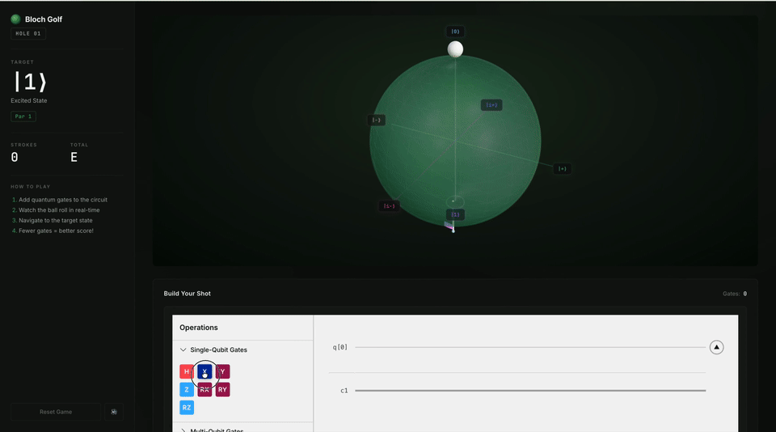

# Qamposer Usecases

Example applications built with [@qamposer/react](https://github.com/QAMP-62/qamposer-react).

## 1. [Quantum Education Platform](./quantum-education-platform/)

**Suitable for quantum education in schools and companies.**

An interactive quantum computing tutorial with step-by-step guidance.

## 2. [Quantum Runner](./quantum-runner/)

**Quantum Circuit as a Controller.**

Quantum mechanics and simulation results can be directly leveraged as game logic.

## 3. [Bloch Golf](https://github.com/nyainman-labs/bloch-golf)

**Quantum State Preparation as Golf.**

Roll a golf ball across the Bloch sphere with quantum gates and sink it into the target state.

Bloch Golf is developed in its own repository:
[nyainman-labs/bloch-golf](https://github.com/nyainman-labs/bloch-golf).

## 4. Coming soon...

## Offline use

Both games are fully client-side — the quantum circuits are simulated in the
browser by `@qamposer/react` — so a production build runs without any network
access. Pre-built static bundles are attached to the releases of each
repository, for workshops and for images such as
[RasQberry-Two](https://rasqberry.org):

| Game | Bundle |
| --- | --- |
| Quantum Runner | [qamposer-usecases releases](https://github.com/QAMP-62/qamposer-usecases/releases) (`quantum-runner-<version>.tar.gz`) |
| Bloch Golf | [bloch-golf releases](https://github.com/nyainman-labs/bloch-golf/releases) (`bloch-golf-<version>.tar.gz`) |

See [quantum-runner/OFFLINE.md](./quantum-runner/OFFLINE.md) for serving instructions.

## License

[Apache-2.0](./LICENSE)
