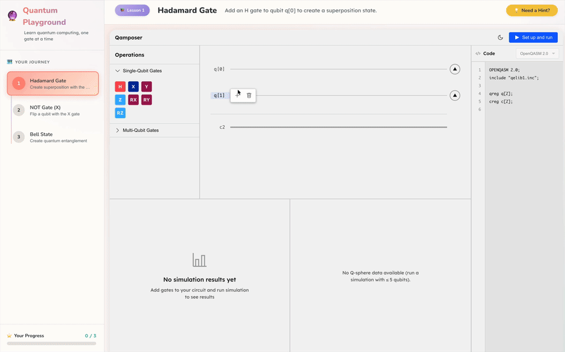

# Quantum Education Platform

An interactive quantum computing tutorial built with [@qamposer/react](https://github.com/QAMP-62/qamposer-react).



## Prerequisites

- Node.js 18+
- [qamposer-backend](https://github.com/QAMP-62/qamposer-backend) running for simulation

## Quick Start

```bash
pnpm install
pnpm dev
```

## Tech Stack

- React 19
- @qamposer/react (Qamposer full version with visualization)
- Vite